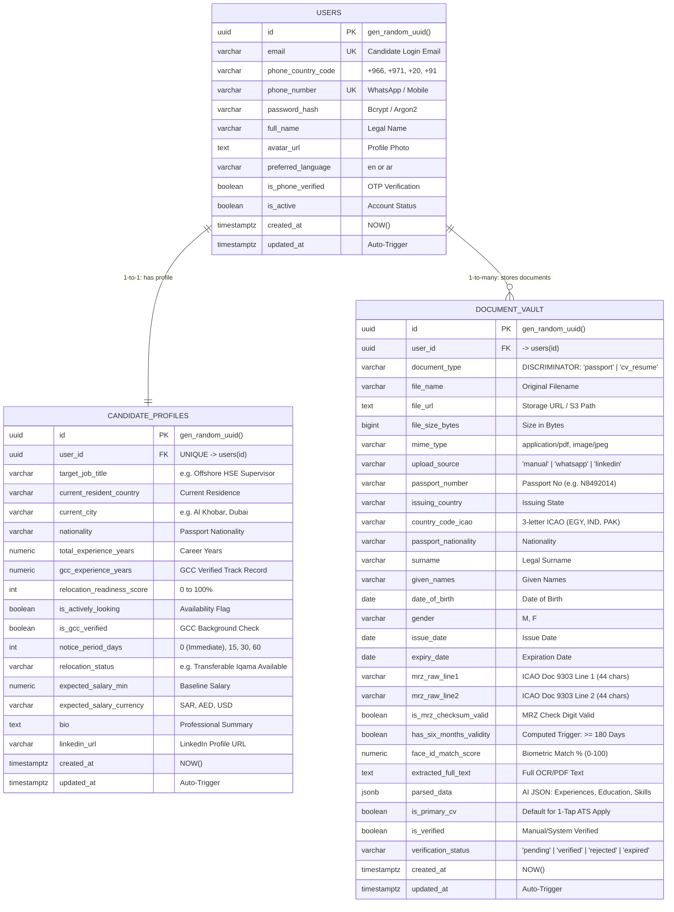

# MENA Mobile Recruitment Platform — Database ER Diagram
## Neon PostgreSQL Architecture (Users, Candidate Profiles & Document Vault)

---

## Relationship Breakdown & Constraints

| From Table | To Table | Relationship | Cardinality | Delete Action | Business Rule |
|---|---|---|---|---|---|
| `users` | `candidate_profiles` | `has_profile` | **1 : 1** | `ON DELETE CASCADE` | Every candidate has exactly one master career profile. |
| `users` | `document_vault` | `stores_documents` | **1 : N** | `ON DELETE CASCADE` | A user can upload their verified Passport and one or more CV/Resumes. |

---

## Architectural Notes for Neon & ATS Integration

1. **Table Discrimination in `document_vault`**:
   - `document_type = 'passport'` activates the ICAO Doc 9303 travel compliance fields (`mrz_raw_line1/2`, `face_id_match_score`, `has_six_months_validity`).
   - `document_type = 'cv_resume'` activates the ATS extraction fields (`parsed_data JSONB`, `extracted_full_text`, `is_primary_cv`).

2. **Automated GCC Visa Validity Trigger**:
   - Every passport record is continuously audited by `trigger_calculate_passport_validity()`. If `expiry_date < CURRENT_DATE + INTERVAL '180 days'`, `has_six_months_validity` turns `FALSE` and status is marked `expired`.

3. **External ATS Bridge**:
   - When candidates apply to jobs fetched from the main ATS website, the mobile app passes:
     - `candidate_profiles.id`
     - `document_vault.file_url` (where `document_type = 'cv_resume'` AND `is_primary_cv = true`)
     - `document_vault.passport_number` and `has_six_months_validity` (where `document_type = 'passport'`)
