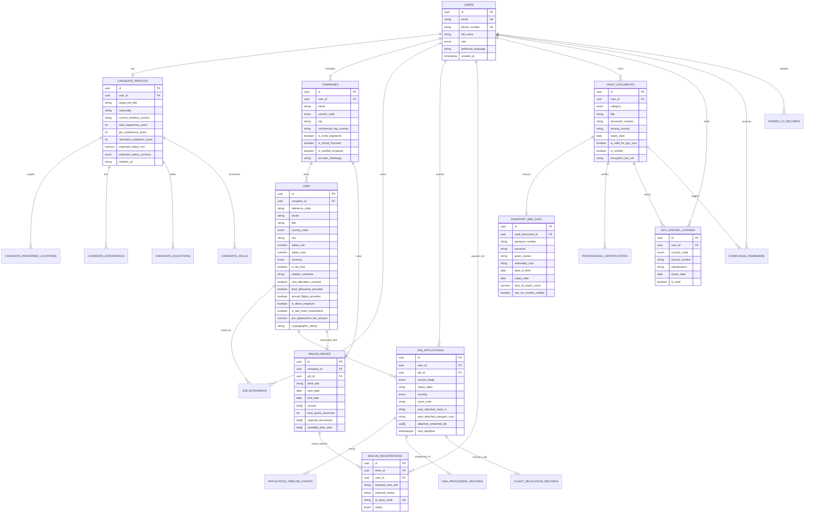

# MENA Mobile Recruitment Platform — Database Architecture & Schema Design

> **Platform**: Global Jobs By Suhana — MENA Mobile Recruitment Platform  
> **Database Engine**: PostgreSQL 15+ / Supabase  
> **Security Standards**: AES-256 local vault encryption, UAE PDPL (Federal Decree-Law No. 45/2021) & KSA PDPL compliance  
> **MRZ Standard**: ICAO Doc 9303 (Machine Readable Travel Documents — TD3 Format)

---

## 1. System Architecture Overview

The database is architected around 6 core operational domains:
1. **User Identity & Candidate Profiles** — Dual-role authentication (Candidates & GCC Employers), structured experience history, LinkedIn sync, and dynamic **Relocation Readiness Score (0–100%)**.
2. **Employers & Verified Vacancies** — Curated GCC enterprise employers with MOFA, CR, and MHRSD licenses, job reference codes (e.g. `PG-HSE-908`), rotation schedules (`28/28 On/Off`), tax-free compensation matrix (AED, SAR, QAR, KWD, OMR, BHD), zero recruitment fees, and employer WhatsApp contacts.
3. **Walk-in Recruitment Drives & QR Fast-Track Passes** — Mega walk-in drives (e.g. Yanbu & Jubail Industrial Cities with 1,200+ quotas), venue selection, time slots, and unique QR entry passes.
4. **6-Stage Relocation Pipeline & Unified Apply** — End-to-end tracking: `Applied` ➔ `Screening` ➔ `Interview` ➔ `Offer Issued` ➔ `Visa Processing` ➔ `Flight & Onboarding` with automatic attachment of stored vault CVs, passports, and verified credential IDs.
5. **Encrypted Document Vault & ICAO MRZ Scanner** — Secure storage of passports (ICAO Doc 9303 MRZ extraction + 98%+ facial match), Saudi Aramco Approval Cards, DHA/MOH healthcare licenses, GCC driving licenses, GAMCA medical fit certs, and degree attestations.
6. **Regulatory Compliance Engine** — Automated 180-day/90-day/30-day expiry calculation, 6-month GCC passport validity checks, and multi-channel reminders (Push, WhatsApp, Email).

---

## 2. Entity-Relationship Diagram (ERD)

---

## 3. Data Dictionary & Table Specifications

### 3.1 `users`
| Column | Type | Constraints | Description |
|---|---|---|---|
| `id` | UUID | PRIMARY KEY, default `uuid_generate_v4()` | Unique user identifier |
| `email` | VARCHAR(255) | UNIQUE, NOT NULL | Candidate or Employer email |
| `phone_country_code` | VARCHAR(8) | NOT NULL | Dial code (e.g., `+971`, `+966`, `+91`) |
| `phone_number` | VARCHAR(20) | UNIQUE, NOT NULL | Primary mobile number |
| `password_hash` | VARCHAR(255) | NOT NULL | Bcrypt / Argon2 hash |
| `role` | `user_role` | NOT NULL, DEFAULT `'candidate'` | Enum: `candidate`, `employer`, `recruiter`, `admin` |
| `full_name` | VARCHAR(150) | NOT NULL | Full legal name |
| `avatar_url` | TEXT | NULLABLE | Profile picture storage URL |
| `preferred_language` | VARCHAR(5) | DEFAULT `'en'` | UI language (`en` or `ar`) |
| `is_phone_verified` | BOOLEAN | DEFAULT FALSE | OTP verification flag |
| `created_at` / `updated_at` | TIMESTAMPTZ | NOT NULL | Timestamp audit |

---

### 3.2 `candidate_profiles`
| Column | Type | Constraints | Description |
|---|---|---|---|
| `id` | UUID | PRIMARY KEY | Profile unique identifier |
| `user_id` | UUID | UNIQUE, FK `users(id)` ON DELETE CASCADE | Owner candidate |
| `target_job_title` | VARCHAR(150) | NOT NULL | Desired role |
| `nationality` | VARCHAR(100) | NOT NULL | Passport country |
| `current_resident_country` | VARCHAR(100) | NOT NULL | Current residence |
| `total_experience_years` | INT | NOT NULL, DEFAULT 0 | Overall career duration |
| `gcc_experience_years` | INT | NOT NULL, DEFAULT 0 | Specific GCC track record |
| `relocation_readiness_score`| INT | 0 to 100 | Dynamic readiness metric |
| `is_actively_looking` | BOOLEAN | DEFAULT TRUE | Availability status |
| `notice_period_days` | INT | DEFAULT 30 | 0 (Immediate), 30, 60, 90 |
| `expected_salary_min` | NUMERIC(12,2)| NULLABLE | Minimum expected baseline |
| `expected_salary_currency` | `currency_code` | DEFAULT `'AED'` | Target currency |
| `linkedin_url` | VARCHAR(255) | NULLABLE | Verified LinkedIn profile link |

---

### 3.3 `jobs`
| Column | Type | Constraints | Description |
|---|---|---|---|
| `id` | UUID | PRIMARY KEY | Job vacancy unique identifier |
| `company_id` | UUID | FK `companies(id)` ON DELETE CASCADE | Verified employer |
| `reference_code` | VARCHAR(50) | NULLABLE | Tracking code (e.g., `PG-HSE-908`) |
| `sector` | `job_sector` | NOT NULL, DEFAULT `'construction'` | `oilGas`, `construction`, `healthcare`, `aviationLogistics`, `hospitality`, `techRenewables` |
| `title` | VARCHAR(200) | NOT NULL | Job title |
| `department` | VARCHAR(100) | NOT NULL | Business unit / Sector |
| `country_code` | `gcc_country_code` | NOT NULL | Enum: `uae`, `sau`, `qat`, `kwt`, `omn`, `bhr` |
| `city` | VARCHAR(100) | NOT NULL | Work location (Dubai, Riyadh, Yanbu, Jubail, etc.) |
| `salary_min` / `salary_max` | NUMERIC(12,2)| NOT NULL | Salary range |
| `currency` | `currency_code` | NOT NULL, DEFAULT `'AED'` | Compensation currency |
| `is_tax_free` | BOOLEAN | NOT NULL, DEFAULT TRUE | Tax exemption indicator |
| `rotation_schedule` | VARCHAR(100) | NULLABLE | e.g., `'28/28 On/Off Rotational'` |
| `visa_allocation_covered` | BOOLEAN | NOT NULL, DEFAULT TRUE | Quota sponsored by employer |
| `food_allowance_provided` | BOOLEAN | NOT NULL, DEFAULT FALSE | Full messing / meal per diem |
| `annual_flights_provided` | BOOLEAN | NOT NULL, DEFAULT TRUE | Paid annual return tickets home |
| `is_direct_employer` | BOOLEAN | NOT NULL, DEFAULT TRUE | Zero middleman / Direct EPC |
| `is_fast_track_mobilization`| BOOLEAN| NOT NULL, DEFAULT FALSE | Visa expedited under 14 days |
| `pre_deployment_fee_amount` | NUMERIC(10,2)| NOT NULL, DEFAULT 0.00 | Strict 0 AED/SAR guarantee |
| `cryptographic_stamp` | VARCHAR(150) | NULLABLE | Institutional verification hash |

---

### 3.4 `walkin_drives` & `walkin_registrations`
| Column | Type | Constraints | Description |
|---|---|---|---|
| `id` | UUID | PRIMARY KEY | Walk-in drive identifier |
| `company_id` | UUID | FK `companies(id)` | Host company / consortium |
| `job_id` | UUID | FK `jobs(id)` NULLABLE | Associated anchor job vacancy |
| `drive_title` | VARCHAR(200) | NOT NULL | e.g. "Mega Walk-in Drive 2025 (Yanbu & Jubail)" |
| `venues` | TEXT[] | NOT NULL | Royal Commission halls, Al-Huwaylat complex |
| `total_quota_vacancies` | INT | NOT NULL, DEFAULT 1200 | Approved labor quota openings |
| `available_time_slots` | TEXT[] | NOT NULL | Time windows (09:00 AM, 11:30 AM, etc.) |
| **`walkin_registrations`** | | | Candidate booking & QR entry passes |
| `qr_pass_code` | VARCHAR(100) | UNIQUE, NOT NULL | Machine-readable scanner pass code |
| `status` | `walkin_pass_status` | NOT NULL | `registered`, `checked_in`, `interviewed`, `shortlisted`, `cancelled` |

---

### 3.5 `job_applications` (Unified Apply with Auto-Attached Vault)
| Column | Type | Constraints | Description |
|---|---|---|---|
| `id` | UUID | PRIMARY KEY | Application ID |
| `user_id` | UUID | FK `users(id)` ON DELETE CASCADE | Jobseeker |
| `job_id` | UUID | FK `jobs(id)` ON DELETE RESTRICT | Target job |
| `current_stage` | `relocation_stage` | NOT NULL, DEFAULT `'applied'` | `applied` ➔ `screening` ➔ `interview` ➔ `offerIssued` ➔ `visaProcessing` ➔ `flightOnboarding` |
| `status_label` | VARCHAR(100) | NOT NULL | User-friendly stage subtext |
| `severity` | `status_severity` | NOT NULL, DEFAULT `'info'` | `verified`, `review`, `critical`, `info` |
| `cover_note` | TEXT | NULLABLE | Applicant custom pitch note |
| `auto_attached_vault_cv` | VARCHAR(255) | NULLABLE | Filename pulled directly from candidate vault |
| `auto_attached_passport_num` | VARCHAR(50) | NULLABLE | Verified passport attached automatically |
| `attached_credential_ids` | UUID[] | DEFAULT `'{}'` | Array of attached certification IDs (Aramco card, NEBOSH, etc.) |
| `next_deadline` | TIMESTAMPTZ | NULLABLE | Upcoming SLA or submission deadline |

---

### 3.6 `vault_documents`, `passport_mrz_data` & `gcc_driving_licenses`
| Column | Type | Constraints | Description |
|---|---|---|---|
| `id` | UUID | PRIMARY KEY | Document unique ID |
| `user_id` | UUID | FK `users(id)` ON DELETE CASCADE | Document owner |
| `category` | `document_category` | NOT NULL | `passport`, `visa`, `educationAttestation`, `medicalGamca`, `policeClearance`, `tradeLicense`, `aramcoCard`, `healthLicence` |
| `title` | VARCHAR(200) | NOT NULL | Document name |
| `document_number` | VARCHAR(100) | NOT NULL | Passport/License/Certificate number |
| `expiry_date` | DATE | NULLABLE | Document expiration date |
| `is_valid_for_gcc_visa` | BOOLEAN | NOT NULL, DEFAULT FALSE | Must have ≥ 6 months validity |
| `is_verified` | BOOLEAN | NOT NULL, DEFAULT FALSE | System/MRZ/Admin verified |
| `face_id_match_score` | NUMERIC(5,2)| DEFAULT 98.0 | MRZ photo vs biometric selfie match % |
| **`gcc_driving_licenses`** | | | GCC localized driving licenses (Light/Heavy) |
| `country_code` | `gcc_country_code` | NOT NULL | Issuing GCC state (sau, uae, qat, etc.) |
| `classification` | VARCHAR(100) | NOT NULL | Light vehicle, heavy truck, equipment operator |

---

## 4. MENA Cross-Border Regulatory & Business Rules

1. **6-Month Passport Validity Rule (ICAO Doc 9303)**:
   - Any passport whose `expiry_date - CURRENT_DATE < 180 days` triggers `is_valid_for_gcc_visa = FALSE` and sets severity to `critical`.
2. **GAMCA (Gulf Health Council) Medical Rule**:
   - Fit certificates are valid for **90 days** from test date. If unutilized within 90 days, a re-test alert is scheduled in `compliance_reminders`.
3. **Degree MOFA & Embassy Attestation Chain**:
   - Notary Public ➔ Home Country Ministry of External Affairs (MEA) ➔ GCC Embassy in Origin ➔ Destination MOFA. Tracked via `is_mofa_attested` in `candidate_educations`.
4. **Saudi Council of Engineers (SCE) / UAE Health Authorities (DHA/MOH)**:
   - Mandatory verification for engineering and healthcare roles prior to visa issuance.
5. **Data Privacy (UAE PDPL & KSA PDPL)**:
   - Local vault credentials encrypted with AES-256.
   - Row Level Security (RLS) restricts document access strictly to `auth.uid() = user_id`.
