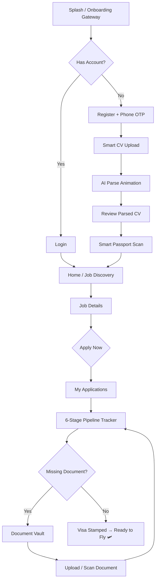

# MENA Mobile Recruitment Platform — Flutter Implementation Plan

> **Project**: Global Jobs By Suhana — MENA Mobile Recruitment Platform
> **Source**: Stitch MCP Project `14640838489817443185` (Gulf Maritime & Amber Horizon Design System)
> **Tech Stack**: Flutter (Dart) — iOS & Android
> **Architecture**: Feature-first Clean Architecture with Riverpod

---

## 1. Project Overview

A cross-border recruitment mobile app connecting jobseekers (skilled trades to C-suite) with verified GCC/MENA employers. The app manages the full relocation lifecycle: job discovery → application → visa processing → flight & onboarding.

### Core Capabilities
- **Job Discovery & Search** — GCC country filtering, visa-sponsored jobs, salary comparisons in AED/SAR/QAR/KWD/OMR/BHD
- **AI-Powered CV Parsing** — Upload PDF/DOCX, AI extracts structured profile data
- **Smart Passport MRZ Scanner** — Camera-based OCR for ICAO 9303 passport Machine Readable Zone
- **6-Stage Relocation Pipeline Tracker** — Applied → Screening → Interview → Offer → Visa Processing → Flight
- **Encrypted Document Vault** — Secure storage for passports, MOFA attestations, GAMCA medical certs, PCC, trade licenses
- **Regulatory Compliance Engine** — Passport 6-month validity checker, degree attestation tracking, expiry reminders
- **RTL & Bilingual Support** — English and Arabic (العربية) with full RTL layout

---

## User Review Required

> [!IMPORTANT]
> **Backend & API Strategy**: This plan focuses on the Flutter frontend. The backend API (REST/GraphQL) must be decided. Options include:
> - Firebase (Firestore + Cloud Functions + Firebase Auth + Cloud Storage)
> - Supabase (PostgreSQL + Edge Functions + Auth + Storage)
> - Custom backend (Node.js/Python + PostgreSQL)

> [!IMPORTANT]
> **AI CV Parsing Service**: The CV parsing feature requires a backend AI service. Recommended: Google Cloud Document AI or Gemini API for structured data extraction from resumes.

> [!WARNING]
> **Passport/Document Security**: Storing passport scans and MRZ data requires compliance with data protection regulations (UAE PDPL, KSA PDPL). Encryption at rest and in transit is mandatory. This plan uses `flutter_secure_storage` + AES-256 for local vault.

---

## Open Questions

> [!IMPORTANT]
> 1. **Authentication Method**: Email/password + OTP? Or social login (Google, Apple)? Or phone-number-only (common in MENA)?
> 2. **Backend Provider**: Firebase, Supabase, or custom REST API?
> 3. **Push Notification Service**: FCM (Firebase Cloud Messaging) or OneSignal?
> 4. **WhatsApp Integration**: Use WhatsApp Business API for visa deadline alerts, or just deep-link to WhatsApp?
> 5. **Monetization Model**: Free for jobseekers? Employer subscription? Placement fees?
> 6. **Offline Mode**: Should job listings and vault documents be available offline?
> 7. **App Name**: "Global Jobs By Suhana" or a different brand name?

---

## 2. Stitch Design System → Flutter Theme Mapping

### 2.1 Color Palette — `Gulf Maritime & Amber Horizon`

| Token | Hex | Flutter Usage |
|---|---|---|
| Primary Navy | `#0F1E36` | `ColorScheme.primary`, AppBar, primary CTA |
| Primary Container | `#0F1E36` | `ColorScheme.primaryContainer` |
| Secondary Amber | `#D97706` | `ColorScheme.secondary`, "Apply Now", salary highlights |
| Secondary Container | `#FE932C` | `ColorScheme.secondaryContainer` |
| Tertiary Emerald | `#059669` | `ColorScheme.tertiary`, verified badges |
| Tertiary Container | `#002416` | `ColorScheme.tertiaryContainer` |
| Neutral Slate | `#64748B` | Inactive icons, helper text |
| Surface | `#F8F9FF` | `ColorScheme.surface`, scaffold background |
| Surface Container | `#E5EEFF` | Card backgrounds, elevated modules |
| On Surface | `#0B1C30` | Primary text color |
| Outline | `#75777E` | Borders, dividers |
| Outline Variant | `#C5C6CE` | Subtle borders |
| Error | `#BA1A1A` | `ColorScheme.error` |

### Semantic Status Colors

| Status | Background | Text | Border | Usage |
|---|---|---|---|---|
| Verified / Success | `#ECFDF5` | `#065F46` | `#A7F3D0` | Visa granted, verified employer |
| In Review / Amber | `#FFFBEB` | `#92400E` | `#FDE68A` | Pending attestation, medical |
| Critical / Expiring | `#FEF2F2` | `#991B1B` | `#FECACA` | Document expiring, action required |
| Info / Processing | `#F1F5F9` | `#0F1E36` | `#CBD5E1` | HR review, processing |

### 2.2 Typography

| Style | Font | Size | Weight | Line Height | Usage |
|---|---|---|---|---|---|
| `displayLarge` | Plus Jakarta Sans | 36px | 800 | 44px | Hero metrics (desktop) |
| `displayMedium` | Plus Jakarta Sans | 28px | 800 | 34px | Hero metrics (mobile) |
| `headlineLarge` | Plus Jakarta Sans | 24px | 700 | 30px | Section titles |
| `headlineMedium` | Plus Jakarta Sans | 20px | 600 | 26px | Card titles |
| `headlineSmall` | Plus Jakarta Sans | 18px | 600 | 24px | Job titles, CTA text |
| `bodyLarge` | Plus Jakarta Sans | 16px | 400 | 24px | Body text |
| `bodyMedium` | Plus Jakarta Sans | 14px | 400 | 20px | Descriptions |
| `bodySmall` | Plus Jakarta Sans | 12px | 400 | 16px | Metadata, captions |
| `labelMedium` | JetBrains Mono | 11px | 500 | 14px | Passport numbers, MRZ, UIDs |
| `labelSmall` | Plus Jakarta Sans | 11px | 700 | 14px | CAPS labels, category headers |

### 2.3 Component Geometry

| Component | Border Radius | Height | Notes |
|---|---|---|---|
| Cards & Modules | 16px (`rounded-2xl`) | — | 1px border `#E2E8F0` |
| Primary Buttons | 12px (`rounded-xl`) | 52px | Navy `#0F1E36` bg, white text |
| Secondary Buttons | 12px (`rounded-xl`) | 52px | Amber `#D97706` bg |
| Form Inputs | 12px (`rounded-xl`) | 50px | White bg, 1.5px border `#E2E8F0` |
| Status Chips | 9999px (`full pill`) | — | Low-saturation semantic colors |
| Country Flags | 8px (`rounded-lg`) | 16px | 24×16px rectangle |
| Avatars | 9999px (`circle`) | — | Circular crop |
| Bottom Nav | 0px (flat) | 72px | Frosted glass, blur backdrop |

### 2.4 Elevation & Depth

| Level | Surface | Shadow | Usage |
|---|---|---|---|
| Level 0 | `#F8FAFC` | None | Canvas / scaffold background |
| Level 1 | `#FFFFFF` | `0 1px 3px rgba(15,30,54,0.04), 0 4px 8px rgba(15,30,54,0.02)` | Cards, modules |
| Level 2 | `#FFFFFF` | `0 8px 24px rgba(15,30,54,0.08)` | Active/selected cards, modals |
| Level 3 | `#FFFFFF` 98% + 16px blur | `0 -4px 16px rgba(15,30,54,0.05)` | Bottom nav, bottom sheets |

---

## 3. Screen Inventory (from Stitch)

| # | Screen ID | Title | Feature Module | Priority |
|---|---|---|---|---|
| 1 | `83ef1684...` | Home & Job Discovery | `jobs` | P0 |
| 2 | `74dd6adc...` | Job Details | `jobs` | P0 |
| 3 | `53b15c21...` | My Applications | `applications` | P0 |
| 4 | `28447e6d...` | Smart CV Upload & AI Parse | `cv_parser` | P0 |
| 5 | `51446e19...` | Review Parsed CV Data | `cv_parser` | P0 |
| 6 | `0d8e0288...` | Profile Strength & Vault | `vault` | P0 |
| 7 | `17c50a0a...` | Candidate Account & Settings | `profile` | P1 |
| 8 | `c558badd...` | Smart Passport Scan (MRZ Camera) | `vault` | P1 |
| 9 | `d422aea1...` | Update Passport & Expiry Reminders | `vault` | P1 |
| 10 | `b1b10dd4...` | Certifications & Licenses | `vault` | P1 |
| 11 | `2e3caf5f...` | GCC Relocation Gateway (Onboarding) | `onboarding` | P0 |

---

## 4. Architecture & Project Structure

### 4.1 Architecture Pattern

**Feature-first Clean Architecture** with separation into:
- **Presentation** — Screens, Widgets, State (Riverpod providers)
- **Domain** — Entities, Use Cases, Repository interfaces
- **Data** — Repository implementations, API clients, DTOs, Local storage

### 4.2 State Management

**Riverpod** (`flutter_riverpod` + `riverpod_annotation` + code generation) for:
- Compile-time safety & testability
- Feature-scoped providers (no global singletons)
- `AsyncValue` for loading/error/data states
- `Notifier` / `AsyncNotifier` for mutable state

### 4.3 Folder Structure

```
e:\mena_mobile_recruitment_platform\
├── pubspec.yaml
├── analysis_options.yaml
├── l10n/                               # ARB localization files
│   ├── app_en.arb
│   └── app_ar.arb
├── assets/
│   ├── fonts/
│   │   ├── PlusJakartaSans/
│   │   └── JetBrainsMono/
│   ├── images/
│   │   ├── flags/                      # GCC country flag PNGs (24x16)
│   │   ├── icons/                      # Custom SVG icons
│   │   └── illustrations/             # Onboarding, empty states
│   └── lottie/                         # Loading animations
├── lib/
│   ├── main.dart                       # App entry point
│   ├── app.dart                        # MaterialApp.router config
│   ├── bootstrap.dart                  # Dependency initialization
│   │
│   ├── core/                           # Shared infrastructure
│   │   ├── theme/
│   │   │   ├── app_theme.dart          # ThemeData, ColorScheme
│   │   │   ├── app_colors.dart         # Color constants + semantic colors
│   │   │   ├── app_typography.dart     # TextTheme definitions
│   │   │   └── app_dimensions.dart     # Spacing, radii, elevation constants
│   │   ├── routing/
│   │   │   ├── app_router.dart         # GoRouter configuration
│   │   │   └── route_names.dart        # Named route constants
│   │   ├── network/
│   │   │   ├── api_client.dart         # Dio HTTP client setup
│   │   │   ├── api_endpoints.dart      # Endpoint constants
│   │   │   └── api_interceptors.dart   # Auth, logging, error interceptors
│   │   ├── storage/
│   │   │   ├── secure_storage.dart     # flutter_secure_storage wrapper
│   │   │   └── local_database.dart     # Drift/Isar local DB
│   │   ├── localization/
│   │   │   └── l10n.dart               # Generated l10n accessor
│   │   ├── widgets/                    # Shared reusable widgets
│   │   │   ├── app_button.dart         # Primary, Secondary, Outline buttons
│   │   │   ├── app_card.dart           # Elevated card with design system
│   │   │   ├── app_chip.dart           # Status chips (semantic colors)
│   │   │   ├── app_text_field.dart     # Styled input fields
│   │   │   ├── country_flag.dart       # GCC flag widget (rounded-lg)
│   │   │   ├── salary_display.dart     # Tabular currency formatter
│   │   │   ├── status_badge.dart       # Verified/Pending/Critical badge
│   │   │   ├── bottom_nav_bar.dart     # Frosted glass bottom navigation
│   │   │   ├── stepper_pipeline.dart   # 6-stage relocation stepper
│   │   │   └── monospace_panel.dart    # JetBrains Mono verification panel
│   │   ├── extensions/
│   │   │   ├── context_extensions.dart
│   │   │   ├── date_extensions.dart
│   │   │   └── string_extensions.dart
│   │   └── utils/
│   │       ├── currency_formatter.dart  # AED, SAR, QAR formatting
│   │       ├── mrz_parser.dart          # ICAO 9303 MRZ regex parser
│   │       ├── validators.dart          # Form field validators
│   │       └── constants.dart           # App-wide constants
│   │
│   ├── features/
│   │   ├── onboarding/                 # GCC Relocation Gateway
│   │   │   ├── presentation/
│   │   │   │   ├── screens/
│   │   │   │   │   └── onboarding_screen.dart
│   │   │   │   └── widgets/
│   │   │   │       ├── country_explorer_grid.dart
│   │   │   │       └── pillar_card.dart
│   │   │   └── providers/
│   │   │       └── onboarding_provider.dart
│   │   │
│   │   ├── auth/                        # Authentication
│   │   │   ├── data/
│   │   │   │   ├── auth_repository_impl.dart
│   │   │   │   └── auth_dto.dart
│   │   │   ├── domain/
│   │   │   │   ├── auth_repository.dart
│   │   │   │   └── user_entity.dart
│   │   │   ├── presentation/
│   │   │   │   ├── screens/
│   │   │   │   │   ├── login_screen.dart
│   │   │   │   │   ├── register_screen.dart
│   │   │   │   │   └── otp_verification_screen.dart
│   │   │   │   └── widgets/
│   │   │   │       └── phone_input_field.dart
│   │   │   └── providers/
│   │   │       └── auth_provider.dart
│   │   │
│   │   ├── jobs/                        # Job Discovery & Details
│   │   │   ├── data/
│   │   │   │   ├── jobs_repository_impl.dart
│   │   │   │   ├── job_dto.dart
│   │   │   │   └── jobs_api.dart
│   │   │   ├── domain/
│   │   │   │   ├── job_entity.dart
│   │   │   │   ├── job_filter.dart
│   │   │   │   └── jobs_repository.dart
│   │   │   ├── presentation/
│   │   │   │   ├── screens/
│   │   │   │   │   ├── home_screen.dart           # Screen 1
│   │   │   │   │   └── job_details_screen.dart    # Screen 2
│   │   │   │   └── widgets/
│   │   │   │       ├── job_card.dart
│   │   │   │       ├── job_filter_bar.dart
│   │   │   │       ├── gcc_country_chips.dart
│   │   │   │       ├── compensation_matrix.dart
│   │   │   │       ├── compliance_checklist.dart
│   │   │   │       ├── relocation_banner.dart
│   │   │   │       └── sticky_apply_bar.dart
│   │   │   └── providers/
│   │   │       ├── jobs_provider.dart
│   │   │       ├── job_details_provider.dart
│   │   │       ├── job_filter_provider.dart
│   │   │       └── bookmark_provider.dart
│   │   │
│   │   ├── applications/                # Application Tracking
│   │   │   ├── data/
│   │   │   │   ├── applications_repository_impl.dart
│   │   │   │   └── application_dto.dart
│   │   │   ├── domain/
│   │   │   │   ├── application_entity.dart
│   │   │   │   ├── relocation_stage.dart
│   │   │   │   └── applications_repository.dart
│   │   │   ├── presentation/
│   │   │   │   ├── screens/
│   │   │   │   │   └── applications_screen.dart   # Screen 3
│   │   │   │   └── widgets/
│   │   │   │       ├── application_card.dart
│   │   │   │       ├── relocation_stepper.dart
│   │   │   │       ├── application_filter_tabs.dart
│   │   │   │       └── missing_document_alert.dart
│   │   │   └── providers/
│   │   │       ├── applications_provider.dart
│   │   │       └── application_filter_provider.dart
│   │   │
│   │   ├── cv_parser/                   # Smart CV Upload & AI Parse
│   │   │   ├── data/
│   │   │   │   ├── cv_parser_repository_impl.dart
│   │   │   │   └── parsed_cv_dto.dart
│   │   │   ├── domain/
│   │   │   │   ├── parsed_cv_entity.dart
│   │   │   │   ├── work_experience.dart
│   │   │   │   ├── education_entry.dart
│   │   │   │   └── cv_parser_repository.dart
│   │   │   ├── presentation/
│   │   │   │   ├── screens/
│   │   │   │   │   ├── cv_upload_screen.dart       # Screen 4
│   │   │   │   │   └── cv_review_screen.dart       # Screen 5
│   │   │   │   └── widgets/
│   │   │   │       ├── upload_drop_zone.dart
│   │   │   │       ├── ai_features_card.dart
│   │   │   │       ├── experience_form_card.dart
│   │   │   │       ├── education_form_card.dart
│   │   │   │       ├── skills_tag_input.dart
│   │   │   │       └── attestation_status_dropdown.dart
│   │   │   └── providers/
│   │   │       ├── cv_upload_provider.dart
│   │   │       └── cv_review_provider.dart
│   │   │
│   │   ├── vault/                       # Document Vault & Passport
│   │   │   ├── data/
│   │   │   │   ├── vault_repository_impl.dart
│   │   │   │   ├── document_dto.dart
│   │   │   │   └── passport_dto.dart
│   │   │   ├── domain/
│   │   │   │   ├── vault_document_entity.dart
│   │   │   │   ├── passport_mrz_entity.dart
│   │   │   │   ├── certification_entity.dart
│   │   │   │   └── vault_repository.dart
│   │   │   ├── presentation/
│   │   │   │   ├── screens/
│   │   │   │   │   ├── vault_screen.dart            # Screen 6
│   │   │   │   │   ├── passport_scan_screen.dart    # Screen 8
│   │   │   │   │   ├── passport_update_screen.dart  # Screen 9
│   │   │   │   │   └── certifications_screen.dart   # Screen 10
│   │   │   │   └── widgets/
│   │   │   │       ├── profile_strength_dial.dart
│   │   │   │       ├── vault_document_tile.dart
│   │   │   │       ├── camera_mrz_viewfinder.dart
│   │   │   │       ├── mrz_verification_panel.dart
│   │   │   │       ├── passport_validity_checker.dart
│   │   │   │       ├── expiry_reminder_config.dart
│   │   │   │       ├── credential_card.dart
│   │   │   │       └── document_category_tabs.dart
│   │   │   └── providers/
│   │   │       ├── vault_provider.dart
│   │   │       ├── passport_scan_provider.dart
│   │   │       ├── passport_reminders_provider.dart
│   │   │       └── certifications_provider.dart
│   │   │
│   │   └── profile/                     # Account & Settings
│   │       ├── data/
│   │       │   ├── profile_repository_impl.dart
│   │       │   └── profile_dto.dart
│   │       ├── domain/
│   │       │   ├── candidate_profile_entity.dart
│   │       │   ├── relocation_preferences.dart
│   │       │   └── profile_repository.dart
│   │       ├── presentation/
│   │       │   ├── screens/
│   │       │   │   └── settings_screen.dart        # Screen 7
│   │       │   └── widgets/
│   │       │       ├── profile_hero_card.dart
│   │       │       ├── availability_toggle.dart
│   │       │       ├── relocation_prefs_card.dart
│   │       │       ├── country_multi_select.dart
│   │       │       ├── security_settings.dart
│   │       │       ├── notification_settings.dart
│   │       │       └── language_rtl_toggle.dart
│   │       └── providers/
│   │           ├── profile_provider.dart
│   │           └── settings_provider.dart
│   │
│   └── generated/                       # Build runner output
│       └── ...
│
├── test/
│   ├── core/
│   │   └── utils/
│   │       ├── mrz_parser_test.dart
│   │       └── currency_formatter_test.dart
│   ├── features/
│   │   ├── jobs/
│   │   │   ├── providers/
│   │   │   │   └── jobs_provider_test.dart
│   │   │   └── data/
│   │   │       └── jobs_repository_test.dart
│   │   ├── applications/
│   │   ├── cv_parser/
│   │   ├── vault/
│   │   └── profile/
│   └── widget_test.dart
│
├── android/
├── ios/
└── web/                                 # Optional PWA support
```

---

## 5. Data Models

### 5.1 Job Entity

```dart
class Job {
  final String id;
  final String title;
  final String companyName;
  final String companyLogoUrl;
  final String countryCode;       // UAE, SAU, QAT, KWT, OMN, BHR
  final String city;
  final double salaryMin;
  final double salaryMax;
  final String currency;          // AED, SAR, QAR, KWD, OMR, BHD
  final bool isTaxFree;
  final String visaStatus;        // "Fully Sponsored", "Transferable Iqama"
  final String accommodation;     // "Provided", "Housing Allowance"
  final List<String> relocationBenefits;
  final bool mofaAttestationRequired;
  final bool gamcaMedicalRequired;
  final DateTime applicationDeadline;
  final bool isVerifiedEmployer;
  final bool isBookmarked;
  final List<String> requiredSkills;
  final String jobDescription;
  final String aboutEmployer;
}
```

### 5.2 Application & Relocation Pipeline

```dart
enum RelocationStage {
  applied,            // 1. Applied & CV Parsed
  screening,          // 2. Recruiter Screening
  interview,          // 3. Technical/Client Interview
  offerIssued,        // 4. Job Offer Issued/Accepted
  visaProcessing,     // 5. GCC Visa (Quota → MOFA → GAMCA → Stamping)
  flightOnboarding,   // 6. Flight & Onboarding
}

class JobApplication {
  final String id;
  final Job job;
  final DateTime appliedDate;
  final RelocationStage currentStage;
  final String statusLabel;
  final StatusSeverity severity;  // verified, review, critical, info
  final List<String> missingDocuments;
  final DateTime? nextDeadline;
  final String? recruiterContact;
}
```

### 5.3 Candidate Profile

```dart
class CandidateProfile {
  final String id;
  final String uid;                    // Displayed in JetBrains Mono
  final String fullName;
  final String email;
  final String phone;
  final String nationality;
  final String residentCountry;
  final String targetTitle;
  final double totalExperienceYears;
  final double gccExperienceYears;
  final int readinessScore;            // 0-100%
  final bool isActivelyLooking;
  final List<String> preferredCountries;
  final double expectedSalary;
  final String expectedCurrency;
  final String noticePeriod;           // "Immediate", "15 Days", etc.
  final String relocationStatus;       // "Single", "Family Package"
  final bool isGccVerified;
}
```

### 5.4 Document Vault & Passport MRZ

```dart
enum DocumentCategory {
  passport, visa, educationAttestation,
  medicalGamca, policeClearance, tradeLicense
}

class VaultDocument {
  final String id;
  final DocumentCategory category;
  final String title;
  final String documentNumber;      // Monospace display
  final String issuingCountry;
  final DateTime? expiryDate;
  final bool isValidForGccVisa;     // > 6 months validity
  final bool isVerified;
  final String fileUrl;
  final bool reminder6Months;
  final bool reminder3Months;
}

class PassportMRZ {
  final String rawMrz;
  final String passportNumber;
  final String surname;
  final String givenNames;
  final String nationality;
  final DateTime dateOfBirth;
  final String gender;
  final DateTime expiryDate;
  final bool hasSixMonthsValidity;
}
```

---

## 6. Navigation Architecture

### 6.1 Bottom Navigation (4 Tabs)

```
┌──────────────────────────────────────────────┐
│  Jobs/Search  │  Applications  │  Vault  │  Profile  │
│   (active)    │   (badge: 4)   │         │          │
└──────────────────────────────────────────────┘
```

### 6.2 Route Map (GoRouter with ShellRoute)

```
/                          → Onboarding Gateway (Screen 11)
/auth/login                → Login
/auth/register             → Registration
/auth/otp                  → OTP Verification

/home                      → ShellRoute (Bottom Nav)
  ├── /jobs                → Home & Job Discovery (Screen 1)
  │   └── /jobs/:id        → Job Details (Screen 2)
  ├── /applications        → My Applications (Screen 3)
  ├── /vault               → Profile Strength & Vault (Screen 6)
  │   ├── /vault/passport-scan     → Smart Passport Scan (Screen 8)
  │   ├── /vault/passport-update   → Update Passport (Screen 9)
  │   └── /vault/certifications    → Certifications (Screen 10)
  └── /profile             → Account & Settings (Screen 7)

/cv/upload                 → Smart CV Upload (Screen 4) — pushed fullscreen
/cv/review                 → Review Parsed CV Data (Screen 5)
```

### 6.3 User Flow Diagram



---

## 7. Dependencies (`pubspec.yaml`)

### Core
| Package | Purpose |
|---|---|
| `flutter_riverpod` + `riverpod_annotation` | State management |
| `go_router` | Declarative routing with ShellRoute |
| `dio` + `retrofit` | HTTP client + type-safe API |
| `freezed` + `json_serializable` | Immutable models + JSON serialization |
| `build_runner` | Code generation |

### UI & Design
| Package | Purpose |
|---|---|
| `google_fonts` | Plus Jakarta Sans, JetBrains Mono |
| `flutter_svg` | SVG icon rendering |
| `cached_network_image` | Cached company logos |
| `shimmer` | Loading skeleton placeholders |
| `lottie` | Animated illustrations |
| `percent_indicator` | Profile strength circular dial |
| `flutter_staggered_animations` | List entry animations |

### Camera & OCR
| Package | Purpose |
|---|---|
| `camera` | Passport MRZ camera viewfinder |
| `google_mlkit_text_recognition` | On-device OCR for MRZ extraction |
| `image_picker` | Gallery upload fallback |

### Document & File
| Package | Purpose |
|---|---|
| `file_picker` | CV upload (PDF, DOCX) |
| `open_file` | Document preview |
| `path_provider` | Local file paths |

### Storage & Security
| Package | Purpose |
|---|---|
| `flutter_secure_storage` | Encrypted local storage (MRZ, tokens) |
| `drift` (or `isar`) | Local SQLite database for offline cache |
| `local_auth` | Biometric (Face ID / Fingerprint) login |

### Localization & RTL
| Package | Purpose |
|---|---|
| `flutter_localizations` | Material RTL support |
| `intl` | Date/number formatting + ARB translations |

### Notifications & Connectivity
| Package | Purpose |
|---|---|
| `firebase_messaging` | Push notifications (FCM) |
| `firebase_analytics` | Usage analytics |
| `connectivity_plus` | Network state monitoring |
| `url_launcher` | WhatsApp deep links, recruiter contact |

---

## 8. Proposed Changes — Implementation Phases

### Phase 1: Foundation & Core (Week 1-2)

#### [NEW] `pubspec.yaml`
- Flutter project initialization, all dependencies, asset declarations, font registration

#### [NEW] `lib/core/theme/` — Design System
- `app_colors.dart` — All hex constants from Gulf Maritime & Amber Horizon
- `app_typography.dart` — TextTheme with Plus Jakarta Sans + JetBrains Mono
- `app_dimensions.dart` — Spacing scale, radii, elevation values
- `app_theme.dart` — Complete `ThemeData` with `ColorScheme`, `InputDecorationTheme`, `ElevatedButtonTheme`, `CardTheme`

#### [NEW] `lib/core/widgets/` — Shared Components
- `app_button.dart`, `app_card.dart`, `app_chip.dart`, `app_text_field.dart`
- `country_flag.dart`, `salary_display.dart`, `status_badge.dart`
- `bottom_nav_bar.dart` (frosted glass, 72px)
- `monospace_panel.dart` (JetBrains Mono verification display)

#### [NEW] `lib/core/routing/app_router.dart`
- GoRouter with ShellRoute for bottom navigation

#### [NEW] `lib/core/network/`
- Dio client, interceptors, endpoint constants

#### [NEW] `l10n/app_en.arb`, `l10n/app_ar.arb`
- Initial English and Arabic string bundles

---

### Phase 2: Job Discovery & Details (Week 2-3)

#### [NEW] `lib/features/jobs/`
- `home_screen.dart` — Search bar, GCC country chips, filter pills, job feed
- `job_details_screen.dart` — Hero, compensation matrix, compliance checklist, sticky apply bar
- `job_card.dart`, `gcc_country_chips.dart`, `compensation_matrix.dart`, etc.
- `jobs_provider.dart` — Paginated job list, filters, bookmarks

---

### Phase 3: CV Parser & Profile Setup (Week 3-4)

#### [NEW] `lib/features/cv_parser/`
- `cv_upload_screen.dart` — Dashed upload zone, LinkedIn import, AI features card
- `cv_review_screen.dart` — Editable form with parsed data, skills tags, attestation status
- `cv_upload_provider.dart` — File upload, AI parse API call
- `cv_review_provider.dart` — Form state management

#### [NEW] `lib/features/onboarding/`
- `onboarding_screen.dart` — Relocation gateway with country explorer and pillar cards

---

### Phase 4: Applications Tracker (Week 4-5)

#### [NEW] `lib/features/applications/`
- `applications_screen.dart` — Segmented tabs, application cards with 6-stage stepper
- `relocation_stepper.dart` — Visual pipeline widget
- `application_card.dart` — Status badges, missing document alerts, CTAs
- `applications_provider.dart` — Filter by stage, real-time status updates

---

### Phase 5: Document Vault & Passport Scanner (Week 5-7)

#### [NEW] `lib/features/vault/`
- `vault_screen.dart` — Profile strength dial, encrypted document grid
- `passport_scan_screen.dart` — Camera viewfinder, MRZ overlay, real-time detection
- `passport_update_screen.dart` — Manual edit form, expiry reminder toggles
- `certifications_screen.dart` — Category tabs, credential cards
- `lib/core/utils/mrz_parser.dart` — ICAO 9303 standard MRZ regex parser
- `vault_provider.dart`, `passport_scan_provider.dart`

---

### Phase 6: Profile & Settings (Week 7-8)

#### [NEW] `lib/features/profile/`
- `settings_screen.dart` — Hero card, availability toggle, relocation preferences, security, notifications, language/RTL toggle
- `profile_provider.dart`, `settings_provider.dart`

---

### Phase 7: Auth & Backend Integration (Week 8-9)

#### [NEW] `lib/features/auth/`
- Login, registration, OTP verification screens
- Firebase/Supabase auth integration
- Biometric login (Face ID / Fingerprint)

---

### Phase 8: Polish, Testing & Launch (Week 9-10)

- Unit tests for all providers, MRZ parser, currency formatter
- Widget tests for key screens
- Integration tests for critical user flows
- Performance profiling (jank, startup time)
- Accessibility audit (TalkBack, VoiceOver, semantic labels)

---

## 9. Verification Plan

### Automated Tests
```bash
# Unit tests
flutter test

# Code generation
dart run build_runner build --delete-conflicting-outputs

# Static analysis
flutter analyze

# Format check
dart format --set-exit-if-changed .
```

### Manual Verification
- **Design Fidelity**: Side-by-side comparison of each screen against Stitch screenshots
- **RTL Layout**: Switch to Arabic and verify all layouts mirror correctly
- **MRZ Scanner**: Test with real passport bio pages (UAE, Indian, Philippine passports)
- **Device Matrix**: Test on iPhone SE (small), iPhone 15 Pro Max (large), Pixel 7, Samsung Galaxy S24
- **Accessibility**: VoiceOver (iOS) and TalkBack (Android) screen reader testing
- **Performance**: Profile startup time < 2s, smooth 60fps scrolling on job feed
